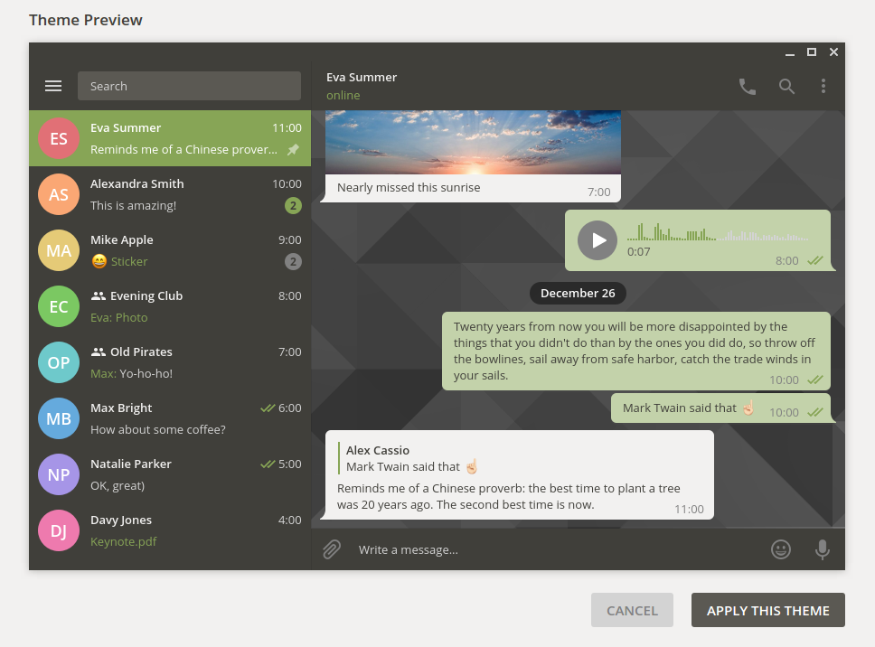
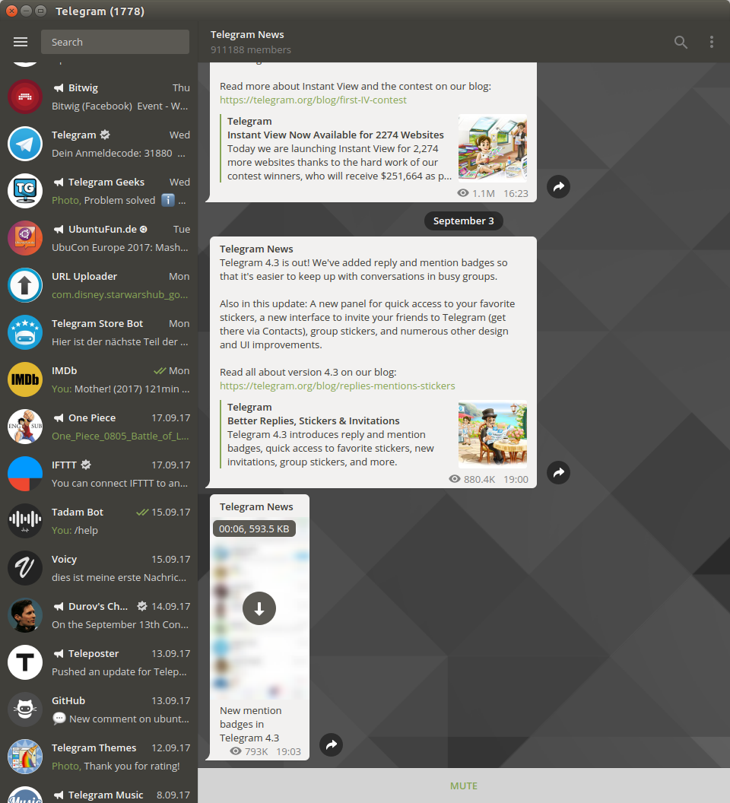

# Ubuntu Theme MATE Edition for Telegram Desktop
#### Version 1.00
A telegram desktop theme in Ubuntu MATE design pattern. It fits perfectly into your Ambiance theming!

### Install
1. Clone the git repisitory github.com/michaelkisiel/ubuntu-mate-telegram-theme or download the file [UbuntuMATE1-00.tdesktop-theme](https://github.com/michaelkisiel/ubuntu-mate-telegram-theme/blob/master/UbuntuMATE1-00.tdesktop-theme)
2. Paste the file into any chat of your telegram desktop client
3. You will be asked to apply the theme showing you a preview before

But here's also an official Telegram Support guide on how to edit and install Telegram Desktop themes: http://telegra.ph/Create-Telegram-Theme-01-12.

### Screenshots

